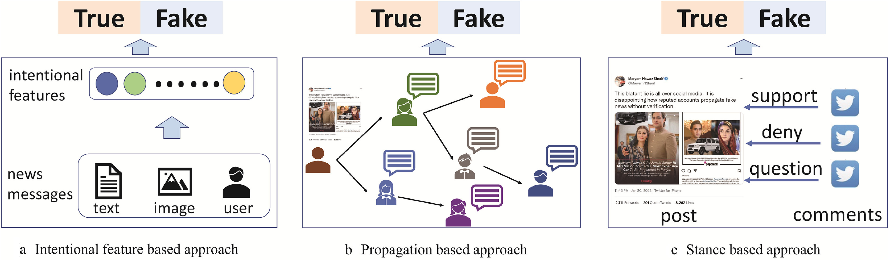

# 修士論文のための論文調査

## 📑 目次
- [方針](#方針)
- [関連研究](#関連研究)
  - [フェイクニュース検出の現況](#フェイクニュース検出の現況)
    - [An overview of fake news detection: From a new perspective(2025)](#an-overview-of-fake-news-detection-from-a-new-perspective2025)
  - [コンテンツベース手法](#コンテンツベース手法)
  - [コンテキストベース手法](#コンテキストベース手法)

---

## 方針
- 関連研究について，フェイクニュース検出手法の現況についてまとめ，提案手法と関わりの薄いコンテンツベースの手法なども広範に調査し詳説する．
- 提案手法は投稿済みの論文に準拠．

## 関連研究
### フェイクニュース検出の現況
- 最新のサーベイ論文を参考に現況をまとめる

#### [An overview of fake news detection: From a new perspective(2025)](https://www.sciencedirect.com/science/article/pii/S2667325824000414)
- フェイクニュースの拡散過程を分析することでフェイクニュースの本質的特徴を整理．
- 意図的な創造：世論の誘導などを目的に意図的に作成されたニュース
- 異形伝播：フェイクニュースは多様なユーザに拡散される傾向があり，異形的な伝播パターンが発生
- 物議を醸した受容：人はリアルニュースよりもフェイクニュースに対して異なる見解をもつ傾向がある．
- これらの特性に基づき，既存手法を意図的特徴ベース，伝播ベース，スタンスベースに整理

| 大分類 (特性) | 中分類 (アプローチ) | 小分類・具体的手法 | 概要・使用される特徴 |
| :--- | :--- | :--- | :--- |
| **Intentional Creation** （意図的生成） | **Intentional feature-based** （意図的特徴ベース） | **Mislead the Public** （公衆の誤解を招く） | ニュースを本物らしく見せるための工夫に着目。 ・**特徴**: URLの有無、人称代名詞、疑問符・感嘆符の使用、「@」タグの数など。 |
| | | **Manipulate Opinions** （意見操作） | 読者の意見を操作するための感情的な言葉遣いに着目。 ・**特徴**: 感情語（Sentiment）、特定の文体・スタイル（Style）。 |
| | | **Attract User Attention** （注目を集める） | トラフィックやクリック数を稼ぐための要素に着目。 ・**特徴**: センセーショナルなトピック、視覚的特徴（画像・動画）、クリックベイト（釣りタイトル）。 |
| | | **General Features** （一般特徴） | 上記以外の一般的な特徴。 ・**特徴**: 時間的特徴（リポストの周期性など）、ユーザー特徴（フォロワー数、登録日）、言語的特徴（TF-IDF、品詞タグ）。 |
| **Heteromorphic Transmission** （異形的伝播） | **Propagation-based** （伝播ベース） | **Message-based** （メッセージベース） | メッセージ間の関係（伝播ツリーなど）をモデル化。 ・**手法**: カーネル法、階層的伝播モデル、GNN（グラフニューラルネットワーク）。 |
| | | **User-based** （ユーザーベース） | ユーザー間の相互作用や、拡散に関与したユーザーの系列をモデル化。 ・**手法**: ユーザープロファイル系列のRNN/CNN処理、ユーザー間相互作用グラフ。 |
| | | **Hybrid** （ハイブリッド） | メッセージ、ユーザー、イベント等の複数の要素間の相互作用を統合。 ・**手法**: TriFN（出版者・ニュース・ユーザーの3者関係）、FANG（社会的文脈の利用）。 |
| **Controversial Reception** （論争的受容） | **Stance-based** （スタンスベース） | **Explicit Stance** （明示的スタンス） | 明示的なスタンスラベルや評価を利用。 ・**手法**: 「賛成」「反対」「疑問」などのラベルを用いたグラフパターンマッチングなど。 |
| | | **Implicit Stance** （暗示的スタンス） | ユーザーの行動やテキストから潜在的なスタンスを推定。 ・**手法**: リポストやコメントの感情分析、ユーザーの過去の行動からの嗜好推定。 |

### コンテンツベース手法

テキストや画像，動画など，”ニュースそのものに付随する情報のみ"を基に検出を行う手法．

### コンテキストベース手法

ニュースの投稿者情報や返信，あるいは伝播情報など，ニュースに関連する外部情報を基に検出を行う手法．
ニュースの社会的文脈をモデルに理解させることで検出精度の向上を図る．